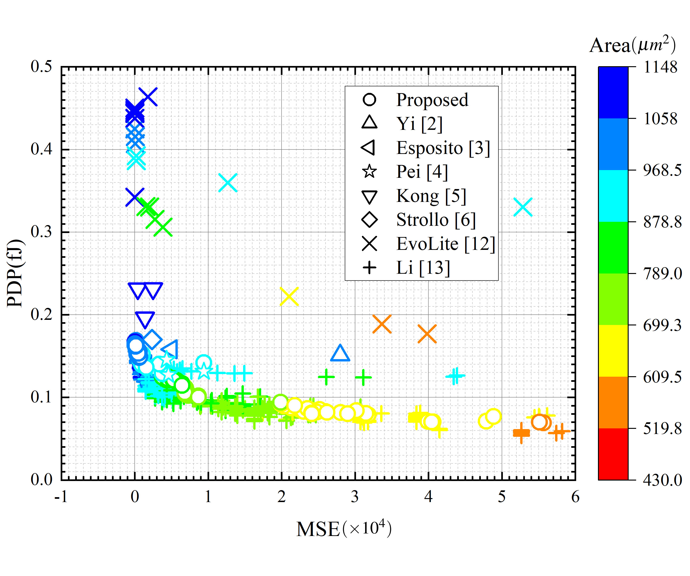

# EVO_AP_MULT
Design approximate multipliers with multiple approximate compressor by evolutionary algorithm.

## Source Code (src)
### 1. Partial Product Model (ppmod)
The exhaustive simulation is a time-consuming task which need lots of test vectors. We analysis the distribution probability of parital products, and proposed the  partial product model which is used for reducing the number of test vectors in simulation. 

### 2. Multi-object Evolutionary Algorithm (evo)
NSGA-II is a multi-objective evolutionary algorithm which is applied in this method. Multiplier searching is conducted by array recoder and wallace tree. We use n-1 compressor in compressed tree include 4-1, 3-1 and 2-1 compressor.Default unsinged version(0<=r<=n-1 for an n*n multiplier). You can directly duplicate the features(N:1 compressors number) to make a signed version change(signed version: 0<=r<=n-2 for an n*n multiplier), then use syn_info.py to generate synthesis information.

### 3. Compressor information (comp)
Give the PPA of need compressors.

## Multipliers
All error metrics and hardware performance metrics of generated multipliers are stored in dat. Please search the number of approximate multiplier you need and use mult_gen.py to generate .  
### 1. Data of result (dat)
The result of proposed experiment, and the type of approximate multipliers are defined as:
    
* Type of multiplier
si: signed
unsi: unsigned

* Width
wid_a: a*a multiplier

* Length of approximate part:
r_b: b is the length of approximate part

Files of each type of multpliers are:
* features.csv: the search result of approximate multipiler which is encoded as a set of integers
* syn_objectivs.csv: simulation results of approximate multipiler which is sorted as : NMED, MRED, PRED, MSE, DELAY, POWER, AREA

### 2. multiplier home (mult_home)
The basic RTL code of each type of approximate multiplier

### The scatter plot of PDP, MSE and Area based on approximate unsigned 8*8 multipliers

## Reference
[1] A. Momeni, J. Han, P. Montuschi, and F. Lombardi, "Design and Analysis of Approximate Compressors for Multiplication," IEEE Transactions on Computers, vol. 64, no. 4, pp. 984-994, 2015, doi: 10.1109/TC.2014.2308214.

[2]	X. Yi, H. Pei, Z. Zhang, H. Zhou, Y. He, and Ieee, "Design of an Energy-Efficient Approximate Compressor for Error-Resilient Multiplications," in IEEE International Symposium on Circuits and Systems (IEEE ISCAS), Sapporo, JAPAN, 26-29 2019, in IEEE International Symposium on Circuits and Systems.

[3]	D. Esposito, A. G. M. Strollo, E. Napoli, D. De Caro, and N. Petra, "Approximate Multipliers Based on New Approximate Compressors," Ieee Transactions on Circuits and Systems I-Regular Papers, vol. 65, no. 12, pp. 4169-4182, Dec 2018, doi: 10.1109/tcsi.2018.2839266.

[4]	H. Pei, X. Yi, H. Zhou, and Y. He, "Design of Ultra-Low Power Consumption Approximate 4-2 Compressors Based on the Compensation Characteristic," Ieee Transactions on Circuits and Systems Ii-Express Briefs, vol. 68, no. 1, pp. 461-465, Jan 2021, doi: 10.1109/tcsii.2020.3004929.

[5]	G. Park, J. Kung, and Y. Lee, "Design and Analysis of Approximate Compressors for Balanced Error Accumulation in MAC Operator," Ieee Transactions on Circuits and Systems I-Regular Papers, vol. 68, no. 7, pp. 2950-2961, Jul 2021, doi: 10.1109/tcsi.2021.3073177.

[6]	T. Kong and S. Li, "Design and Analysis of Approximate 4-2 Compressors for High-Accuracy Multipliers," Ieee Transactions on Very Large Scale Integration (Vlsi) Systems, vol. 29, no. 10, pp. 1771-1781, Oct 2021, doi: 10.1109/tvlsi.2021.3104145.

[7]	A. G. M. Strollo, E. Napoli, D. De Caro, N. Petra, and G. D. Meo, "Comparison and Extension of Approximate 4-2 Compressors for Low-Power Approximate Multipliers," Ieee Transactions on Circuits and Systems I-Regular Papers, vol. 67, no. 9, pp. 3021-3034, Sept 2020, doi: 10.1109/tcsi.2020.2988353.

[8]	L. Sayadi, S. Timarchi, and A. Sheikh-Akbari, "Two Efficient Approximate Unsigned Multipliers by Developing New Configuration for Approximate 4:2 Compressors," IEEE Transactions on Circuits and Systems I: Regular Papers, pp. 1-11, 2023, doi: 10.1109/TCSI.2023.3242558.

[9]	K. Deb, A. Pratap, S. Agarwal, and T. Meyarivan, "A fast and elitist multiobjective genetic algorithm: NSGA-II," IEEE Transactions on Evolutionary Computation, vol. 6, no. 2, pp. 182-197, 2002, doi: 10.1109/4235.996017.

[10]	Z. Vasicek and L. Sekanina, "Evolutionary Approach to Approximate Digital Circuits Design," IEEE Transactions on Evolutionary Computation, vol. 19, no. 3, pp. 432-444, 2015, doi: 10.1109/TEVC.2014.2336175.

[11]	V. Mrazek, R. Hrbacek, Z. Vasicek, and L. Sekanina, "EvoApprox8b:  Library of Approximate Adders and Multipliers for Circuit Design and Benchmarking of Approximation Methods," in Design, Automation & Test in Europe Conference & Exhibition (DATE), 2017, 27-31 March 2017 2017, pp. 258-261, doi: 10.23919/DATE.2017.7926993.

[12]	V. Mrazek, Z. Vasicek, L. Sekanina, H. Jiang, and J. Han, "Scalable Construction of Approximate Multipliers With Formally Guaranteed Worst Case Error," IEEE Transactions on Very Large Scale Integration (VLSI) Systems, vol. 26, no. 11, pp. 2572-2576, 2018, doi: 10.1109/TVLSI.2018.2856362.

[13]	Z. Li et al., "Adaptable Approximate Multiplier Design Based on Input Distribution and Polarity," IEEE Transactions on Very Large Scale Integration (VLSI) Systems, vol. 30, no. 12, pp. 1813-1826, 2022, doi: 10.1109/TVLSI.2022.3197229.

[14]	V. Leon, G. Zervakis, S. Xydis, D. Soudris, and K. Pekmestzi, "Walking through the Energy-Error Pareto Frontier of Approximate Multipliers," IEEE Micro, vol. 38, no. 4, pp. 40-49, 2018, doi: 10.1109/MM.2018.043191124.

